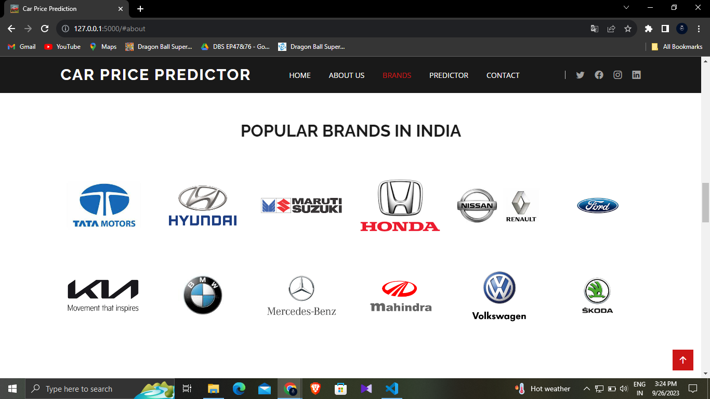

# Car Price Predictor
          

Project link: 
Demo Video: linkedin

## Home Page

# Project Overview
To be able to predict used cars market value can help both buyers and sellers. There are lots of individuals who are interested in the used car market at some points in their life because they wanted to sell their car or buy a used car. In this process, it’s a big corner to pay too much or sell less then it’s market value.

In this Project, we are going to predict the Price of Used Cars using various features like Present_Price, Selling_Price, Kms_Driven, Fuel_Type, Year etc. The data used in this project was downloaded from Kaggle.

# Aim

This project aims to provide a useful tool for both buyers and sellers in the automotive market, assisting them in making informed decisions about car pricing and predict the Price of an used Car by taking it's Company name, it's Model name, Year of Purchase, and other parameters.

## About

## Following steps will be followed to reach our goal:

1) Importing libraries
2) Reading the concerned dataset
3) Data Understanding
4) Data handling
5) Data visualization
6) Data preparation
7) Splitting the Data and feature scaling
8) Building a linear regression model
9) Residual analysis of the train data
10) Making Predictions Using the Final Model
11) Model Evaluation
12) Conclusion

## Brands

## Built with
* Python
* Google Colab
* HTML
* CSS
* JavaScript

## Libraries

* sklearn
* sklearn.preprocessing
* sklearn.compose
* sklearn.pipeline
* sklearn.metrics
* keras
* PIL
* pathlib
* scipy
* os
* numpy
* matplotlib.pyplot
* pandas
* Flask
* Flask-Cors
* seaborn
 
## Featured Car

## Prediction Page

# Description

## What this project does?

1. This project takes the parameters of an used car like: Company name, Model name, Year of Purchase, Fuel Type and Number of Kilometers it has been driven.
2. It then predicts the possible price of the car. For example, the image below shows the predicted price of our Tata Tiago Revotorq.
   
## Result

## How this project does?

1. First of all the data was scraped from Quikr.com (https://quikr.com) 
Link for data: https://github.com/BHARATHVAJSARAVANAN/BV-Car-Price-Predictor/blob/master/quikr_car.csv

2. The data was cleaned (it was super unclean :( ) and analysed.

3. Then a Linear Regression model was built on top of it which had 0.92 R2_score.

   Link for notebook :https://github.com/BHARATHVAJSARAVANAN/BV-Car-Price-Predictor/blob/master/quikr_predictor.py

4. This project was given the form of an website built on Flask where we used the Linear Regression model to perform predictions.

## How to run on your local host?

Prerequisite: Download all files from Github Link :https://github.com/BHARATHVAJSARAVANAN/BV-Car-Price-Predictor

Download PyCharm

1. Create new environment using command --> conda create -n env_name python==3.10.2
   
2. Activate environment using command --> conda activate env_name
   
3. Install requirements by typing (cd ProjectFolder) --> pip install -r requirements.txt
   
4. Now run app.py by writing command --> python app.py

OR

Download VScode

1. Download Project code from github 
   
2. Open Car Price Predictor Folder in VScode.
   
3. Open Terminal and Install requirements by typing (cd ProjectFolder) --> pip install -r requirements.txt
   
4. Now run app.py by writing command --> python app.py

CAR DATASET:https://github.com/BHARATHVAJSARAVANAN/BV-Car-Price-Predictor/blob/master/quikr_car.csv
